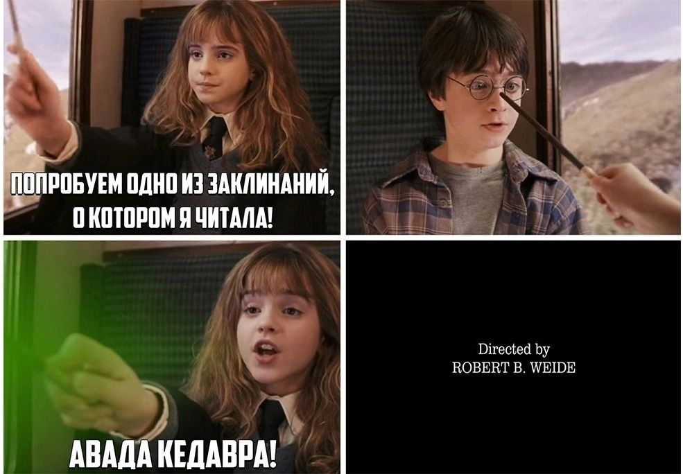

# Учебные задания по Python (базовый уровень)

Выполните следующие задания. Решения для каждого задания пишите в отдельном файле в папке `tasks/`.

---

## Задание 1. Журавлики
В файле `tasks/task1.py`

Петя, Катя и Сережа делают из бумаги журавликов. Вместе они сделали S журавликов. Сколько журавликов сделал каждый ребенок, если известно, что Петя и Сережа сделали одинаковое количество журавликов, а Катя сделала в два раза больше журавликов, чем Петя и Сережа вместе?

Входные данные
Поступает одно натуральное число S – общее количество сделанных журавликов.

Выходные данные!!
В единственную строку нужно вывести три числа, разделенных пробелами – количество журавликов, которые сделал каждый ребенок (Петя, Катя и Сережа).

## Подсказска используйте целочисленное деление "//"

```
Sample Input 1:

6
Sample Output 1:

1 4 1
Sample Input 2:

24
Sample Output 2:

4 16 4
```
---

## Задание 2. Магазин канцелярских товаров
В файле `tasks/task2.py` 
Однажды, посетив магазин канцелярских товаров, Вася купил X карандашей, Y ручек и Z фломастеров. Известно, что цена ручки на 2 рубля больше цены карандаша и на 7 рублей меньше цены фломастера. Также известно, что стоимость карандаша составляет 3 рубля. Требуется определить общую стоимость покупки.
```
Sample Input 1:

1 1 1
Sample Output 1:

20
Sample Input 2:

23 8 76
Sample Output 2:

1021
```
---

## Задание 3. Два бандита
В файле `tasks/task3.py` 
Гарри и Ларри решили пострелять по банкам, выставленным на бревно. Они стреляли одновременно, но с разных сторон:

    ➖ Гарри стрелял слева направо;

    ➖ Ларри стрелял справа налево.

В какой-то момент их пули попали в одну и ту же последнюю банку, после чего стрельба прекратилась.

Теперь они спорят, кто кому должен деньги за то, что помешал насладиться стрельбой. Однако они не помнят, сколько банок было изначально, а лишь знают два значения a и b:

    ●    a — сколько банок успел прострелить Гарри;

    ●    b — сколько банок успел прострелить Ларри.

Ваша задача — определить:

Сколько банок не успел прострелить Гарри;
 
Сколько банок не успел прострелить Ларри.
Входные данные:
Программа получает два целых числа в одной строке:

a (1 ≤ a ≤ 10) — количество банок, которые прострелил Гарри;
b (1 ≤ b ≤ 10) — количество банок, которые прострелил Ларри.
Выходные данные:
Выведите два числа через пробел:

сперва количество банок, которые не успел прострелить Гарри.
затем количество банок, которые не успел прострелить Ларри.

```
Sample Input 1:

4 7
Sample Output 1:

6 3
Sample Input 2:

5 3
Sample Output 2:

2 4
Sample Input 3:

2 7
Sample Output 3:

6 1
```
---

## Задание 4. Функция print
В файле `tasks/task4.py` 

Вам необходимо вывести три фразы, разделяя их тремя дефисами. Сами фразы вводятся с клавиатуры на трех разных строчках

```
Sample Input 1:

Да пребудет
с тобой
Сила
Sample Output 1:

Да пребудет---с тобой---Сила
Sample Input 2:

Белка
каждый год
запасает Орехи
Sample Output 2:

Белка---каждый год---запасает Орехи
```
---
## Задача 5. Волшебная фраза

В файле `tasks/task5.py` 



Гермиона любит вставлять в конце своих заклинаний фразу «Сказала Гермиона!».

Напишите программу, которая:

Принимает на вход строку (заклинание как в примере);

Выводит это же предложение, а в конце добавляет «- Сказала Гермиона!».

Используйте аргумент end в функции print и следите за пробелами и знаками.

Входные данные

Одна строка — текст заклинания или предложения.

Выходные данные
Та же строка с добавлением фразы в конце через -.

```
Пример

Входные данные

Алохомора


Выходные данные

Алохомора - Сказала Гермиона!


Входные данные

Wingardium Leviosa


Выходные данные

Wingardium Leviosa - Сказала Гермиона!
```
Та же строка с добавлением фразы в конце через -.

### Требования
1. Используйте только то, что мы изучили (переменные, ввод `input`, преобразование типов, арифметика, map).
2. Решения пишите в отдельных файлах в папке `tasks/`.
3. Проверка идёт автоматически через автотесты.

## Не забудь команды для git:
```
git clone -клонировать репозитарий
git status - проверить состояние файлов перед индексом и коммитом
git add <имя файла> - добавить файл в индекс
git commit -m"собщение" - добавить файлы и собщение в репозитарий
git push origin main- "запушить" отправить репозитарий на удаленный сервер (Github)
```